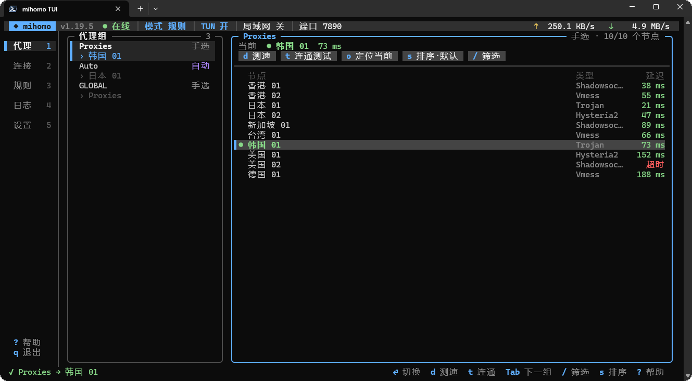
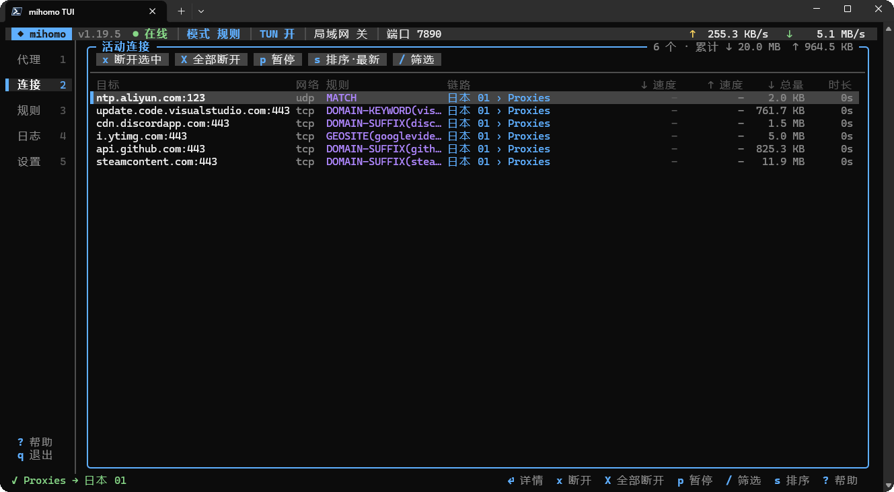
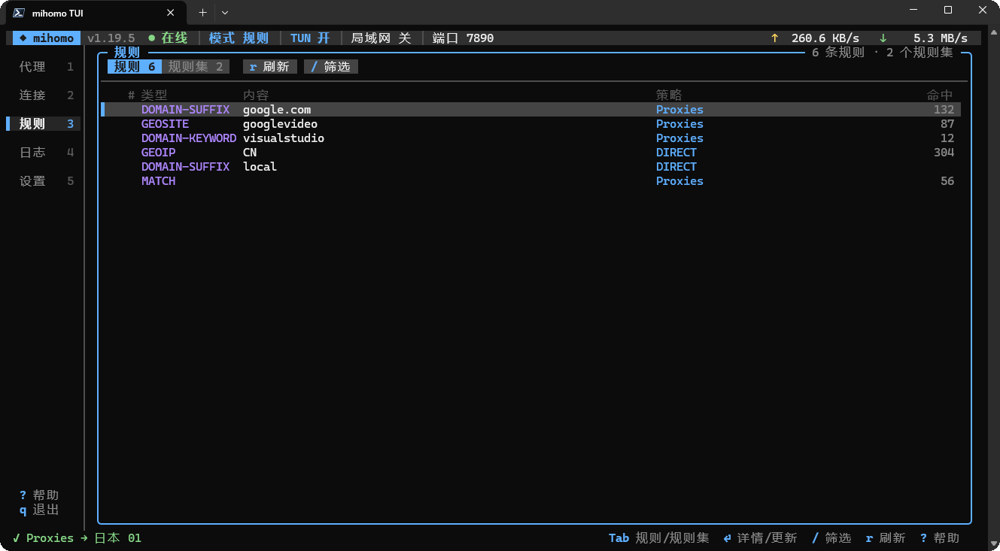
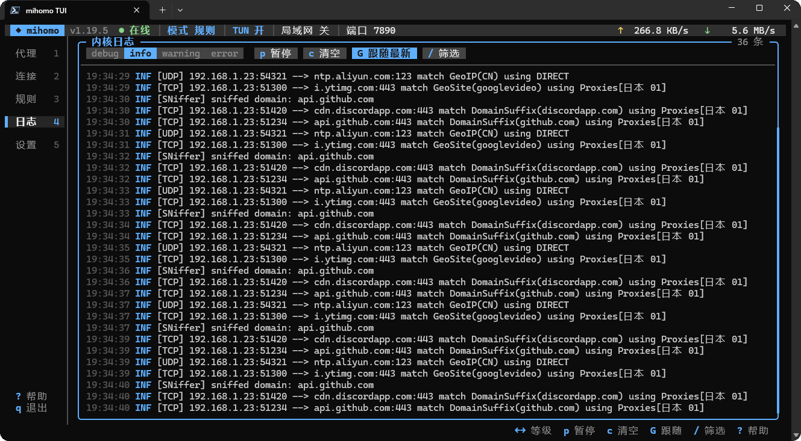
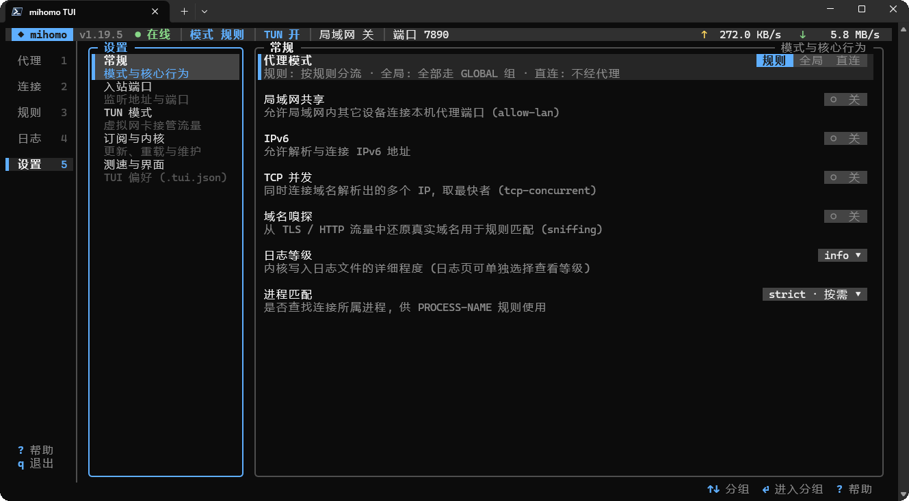

# clashtop

mihomo 控制台 TUI —— Clash Verge 的轻量终端平替。**纯标准库单文件脚本, 零必装依赖**,
键盘 + 鼠标完整可用, 支持 Windows 命名管道控制器 (适配 Clash Verge)。



| 连接 | 规则 |
|:-:|:-:|
|  |  |
| **日志** | **设置** |
|  |  |

| 文件 | 说明 |
|---|---|
| `tui.py` | 主程序, 跨平台 (Windows / Linux / macOS), **唯一源码** |
| `tui-win.py` | Windows 专用版, 由 `_gen_tuiwin.py` 从 `tui.py` 生成, 可独立分发 |
| `_gen_tuiwin.py` | 生成器, 见下文「开发」 |

## 运行要求

- Python ≥ 3.8, **无需安装任何依赖** (Windows 也不需要 windows-curses)
- 可选: `pip install pyyaml` —— 仅用于「修改写回 config.yaml」功能, 缺失时其余功能不受影响
- POSIX 鼠标需终端支持 SGR(1006) 协议 (xterm / Windows Terminal / tmux 等均支持);
  不支持时鼠标无效, 键盘照常

## 快速开始

```bash
python tui.py                 # 任意平台
python tui-win.py             # Windows (独立分发版, 等价)
```

不带参数即可: 启动时自动探测控制器 —— 上次成功的连接 → Clash Verge / Mihomo Party
等前端与内核配置里的 `external-controller` / `secret` → Windows 命名管道 →
常见端口 9097/9090。需要密钥而配置里没有时, 启动时提示输入并记住。

```
用法: tui.py [-a ADDR | --host HOST -p PORT] [-s KEY] [代理组名]

  -a, --api ADDR   控制器地址 http://127.0.0.1:9097, 或 pipe:管道名 / pipe:auto
  --host HOST      控制器主机 (默认 127.0.0.1)
  -p, --port PORT  控制器端口 (默认 9097)
  -s, --secret KEY API 密钥
  代理组名          启动时选中的代理组 (默认自动选择)

环境变量: MIHOMO_API  MIHOMO_HOST  MIHOMO_PORT  MIHOMO_SECRET
```

`pipe:auto` 自动枚举 `\\.\pipe\` 下 `verge-mihomo-*` / `*mihomo*` 命名管道。

## 界面

左侧导航或数字键 `1`-`5` 切换页面:

| 页 | 功能 |
|---|---|
| 1 代理 | 代理组/节点选择 (单击即切换)、批量/单点测速、排序、筛选、经代理连通测试 |
| 2 连接 | 实时连接列表与速度、断开选中/全部、查看详情 |
| 3 规则 | 规则与规则集, 规则集详情中可更新远程规则集 |
| 4 日志 | 内核实时日志, 等级切换 / 暂停 / 清空 / 跟随最新 |
| 5 设置 | 常规 / 入站端口 / TUN / 订阅与内核 / 测速与界面, 分组选项管理 |

常用键: `↑↓/jk` 移动 · `←→/hl` 切换焦点 · `⏎` 确认 · `Esc` 返回 · `/` 筛选 · `?` 帮助 · `q` 退出

全局键: `m` 切换模式 · `T` TUN 开关 · `a` 局域网共享 · `u` 更新订阅 · `R` 重启内核 · `r` 刷新

鼠标: 单击导航/代理组/节点/按钮/开关/分段选项即生效, 滚轮滚动列表。

## 会读写的文件

均位于脚本同目录 (除自动探测到的前端配置外):

- `config.yaml` — mihomo 内核配置; 开启「修改写回配置文件」后, 运行时修改会合并写回
  (需 PyYAML; 原子替换写入)
- `subscription.url` — 订阅地址, `u` 更新订阅时读取
- `update.sh` / `update.bat` / `update.cmd` / `update.ps1` — 订阅更新脚本, 按序探测执行
- `.tui.json` — 界面偏好 (测速地址/超时/并发、日志等级等) 与上次成功的控制器连接缓存

## 开发

**只改 `tui.py`**。它是唯一源码; `tui-win.py` 是生成产物:

```bash
python _gen_tuiwin.py        # 重新生成 tui-win.py
```

生成器删除 `tui.py` 中 `# >>> posix >>>` … `# <<< posix <<<` 标记的 POSIX 专属代码
(两处: 导入块、终端层), 再换 docstring 与程序名。**新增 POSIX-only 代码时必须包进
该标记块**, 否则会泄漏进 tui-win.py (生成器对标记段数量有断言)。

### tui.py 内部分层 (按 `# ─── xxx ───` 分节)

| 节 | 内容 |
|---|---|
| 数据层 | `api()` REST 封装、命名管道传输 (`pipe:`)、控制器自动探测、偏好读写 |
| 文本宽度 | `cw/tw/clip/wrap` —— CJK 宽字符与组合字符处理 |
| 绘制基础 | 终端层 `Term` (基类 `_TermBase` 帧缓冲 + `_WinTerm`/`_PosixTerm`)、`Theme`、`Hits`、`Canvas`、`ListView` |
| 弹窗 | `Modal` 及 Confirm/Input/Select/Info 弹窗 |
| 页面 | 五个 `Page` 子类 |
| 应用 | `App` 主循环、按键分发、`main()` |

终端抽象接口: `erase()` 清帧缓冲 → `Canvas` 写入 → `refresh()` 逐格对比上帧只重写变化行;
`read(ms)` 返回事件列表 —— 键名字符串、`("press"/"dbl"/"wheel", x, y[, up])` 鼠标元组、
`"resize"`。Windows 走 `ReadConsoleInputW`, POSIX 走 `termios`+select 解析 VT 序列,
SGR 鼠标由 `_seq_event()` 解析。

### 验证

无测试套件。最低验证:

```bash
python -m py_compile tui.py && python _gen_tuiwin.py && python -m py_compile tui-win.py
python tui.py --help
```

POSIX 输入解析可在任意平台单测 (`_seq_event` / `_PosixTerm._keys` 不依赖 termios 即可调用,
它们只是被注释标记圈起来、运行时才经 `else` 导入)。

### mihomo API 使用面

REST: `GET /version` `GET/PATCH /configs` `PUT /configs?force=true` `POST /restart`
`GET/PUT /proxies/{name}` `GET /proxies/{name}/delay` `GET/DELETE /connections`
`GET /rules` `GET/PUT /providers/rules` `POST /configs/geo` `POST /cache/fakeip/flush`;
流式: `/logs?level=` `/traffic` (命名管道下由 `PipeReader` 解 chunked)。

## License

MIT — 见 [LICENSE](LICENSE)。
